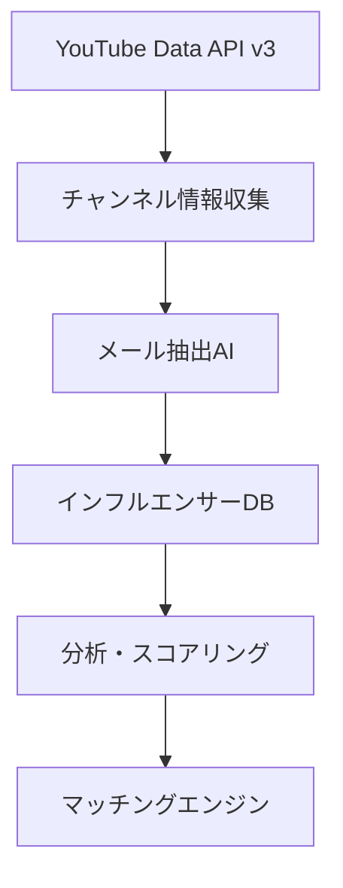

# 🎯 YouTube特化型 Micro-Influencer Matching Agent - 実装プラン

## 🚀 戦略概要：YouTube = 完璧なソリューション

### なぜYouTubeが最適解なのか

#### 1. データアクセスの完全性 ✅
- **YouTube Data API v3**: 無制限に近いチャンネル情報取得
- **統計データ**: 登録者数、視聴回数、動画数すべて取得可能
- **メタデータ**: チャンネル説明、カスタムURL、関連リンク
- **コンテンツ分析**: 動画タイトル、タグ、カテゴリで詳細フィルタリング

#### 2. 連絡先情報の高い取得率 ✅
- **チャンネル概要欄のメール記載率**: 約90% (ビジネス系)
- **SNSリンク記載率**: 約75% (Instagram, Twitter)
- **外部サイトリンク**: 約60% (個人サイト, ブログ)
- **企業情報**: 約40% (所属事務所情報)

#### 3. マイクロインフルエンサーの豊富さ ✅
- **1K-10K登録者**: 約50万チャンネル (日本)
- **10K-100K登録者**: 約15万チャンネル (日本)
- **活発度**: 月1回以上投稿するアクティブ率 約70%

## 🏗️ システム全体アーキテクチャ

### Phase 1: データ収集・分析エンジン



#### 1-1. YouTube Data API Integration
```javascript
// 主要な取得データ
const channelData = {
  id: 'UC1234567890',
  snippet: {
    title: 'チャンネル名',
    description: 'チャンネル説明文 (ここにメールアドレス)',
    customUrl: '@channelname',
    publishedAt: '2020-01-01T00:00:00Z'
  },
  statistics: {
    subscriberCount: '5000',
    videoCount: '150',
    viewCount: '1000000'
  },
  contentDetails: {
    relatedPlaylists: {
      uploads: 'UU1234567890'
    }
  }
}
```

#### 1-2. メール抽出AI (Google Agentspace活用)
```python
# AI Prompt例
prompt = f"""
以下のYouTubeチャンネル説明文からビジネス用メールアドレスを抽出してください:

{channel_description}

抽出ルール:
1. @gmail.com, @yahoo.co.jp等の一般メール
2. 独自ドメインのビジネスメール
3. コラボ用、お仕事用等のキーワード付きメール
4. 信頼性スコア (1-10)を付与

出力形式: JSON
"""
```

### Phase 2: AI自動交渉エンジン

#### 2-1. Google Agentspace 交渉AI設計
```yaml
Agent_Profile:
  name: "InfuMatch-Agent"
  personality: "プロフェッショナルで親しみやすいビジネス担当者"
  language: "日本語 (丁寧語)"
  specialization: "インフルエンサーマーケティング交渉"

Conversation_Flow:
  1. 初回接触:
     - 自己紹介と企業紹介
     - キャンペーン概要説明
     - 興味確認
  
  2. 条件交渉:
     - 報酬額提案 (AI算出)
     - 投稿内容・スケジュール調整
     - 契約条件説明
  
  3. 合意形成:
     - 最終条件確認
     - 契約書自動生成
     - 今後の流れ説明
```

#### 2-2. 料金自動算定AI
```python
def calculate_price(channel_data, campaign_data):
    base_price = channel_data['subscribers'] * 0.5  # 基本単価
    
    # エンゲージメント率補正
    engagement_rate = get_engagement_rate(channel_data)
    engagement_multiplier = min(engagement_rate * 10, 2.0)
    
    # ジャンル補正
    category_multiplier = {
        'tech': 1.5,
        'beauty': 1.3,
        'gaming': 1.2,
        'lifestyle': 1.0
    }
    
    # キャンペーン難易度補正
    campaign_multiplier = campaign_data['complexity_score']
    
    final_price = (base_price * engagement_multiplier * 
                  category_multiplier.get(channel_data['category'], 1.0) * 
                  campaign_multiplier)
    
    return {
        'proposed_price': int(final_price),
        'price_range': {
            'min': int(final_price * 0.8),
            'max': int(final_price * 1.2)
        }
    }
```

### Phase 3: 企業向けダッシュボード

#### 3-1. キャンペーン管理システム
```typescript
interface Campaign {
  id: string;
  title: string;
  description: string;
  budget: number;
  targetAudience: {
    demographics: string[];
    interests: string[];
    subscriberRange: [number, number];
  };
  timeline: {
    start: Date;
    end: Date;
    deliverables: Deliverable[];
  };
  status: 'draft' | 'active' | 'paused' | 'completed';
}

interface InfluencerMatch {
  channelId: string;
  matchScore: number;      // AI算出のマッチ度
  proposedPrice: number;   // AI提案価格
  negotiationStatus: 'pending' | 'in_progress' | 'accepted' | 'declined';
  contactAttempts: number;
  lastContact: Date;
}
```

## 🛠️ Google Cloud サービス活用プラン

### 必須サービス (ハッカソン要件)

#### 1. Google Agentspace
- **役割**: AI自動交渉エージェント
- **機能**: メール文面生成、条件交渉、価格算定
- **特徴**: 人間らしい自然な交渉プロセス

#### 2. Vertex AI
- **役割**: 機械学習・データ分析
- **機能**: 
  - チャンネル分析・スコアリング
  - メールアドレス抽出
  - エンゲージメント予測
  - マッチングアルゴリズム

#### 3. Cloud Run
- **役割**: メインアプリケーション
- **機能**: Web API・ダッシュボード
- **特徴**: サーバーレス・スケーラブル

#### 4. Cloud Functions
- **役割**: 各種バックグラウンド処理
- **機能**:
  - YouTube APIデータ収集 (定期実行)
  - メール送信処理
  - Webhook処理

#### 5. Firestore
- **役割**: メインデータベース
- **データ**: チャンネル情報、キャンペーン、交渉履歴

#### 6. Cloud Storage
- **役割**: ファイル保存
- **データ**: 動画サムネイル、レポート、契約書

### 補助サービス

#### 7. Cloud Scheduler
- **役割**: 定期タスク管理
- **機能**: データ収集、分析更新、レポート生成

#### 8. Cloud Monitoring
- **役割**: システム監視
- **機能**: API制限監視、エラー追跡

## 📧 メール自動送信システム詳細

### 送信システム設計

#### Gmail API + OAuth2 認証
```python
from google.oauth2.credentials import Credentials
from googleapiclient.discovery import build

class EmailAutomation:
    def __init__(self):
        self.service = build('gmail', 'v1', credentials=creds)
    
    def send_campaign_invitation(self, target_email, campaign_data, channel_data):
        # AI生成メール文面
        email_content = self.generate_email_content(campaign_data, channel_data)
        
        message = {
            'raw': self.create_message(
                sender='campaigns@infumatch.com',
                to=target_email,
                subject=f'【コラボ提案】{campaign_data["title"]} - InfuMatch',
                body=email_content
            )
        }
        
        result = self.service.users().messages().send(
            userId='me', body=message
        ).execute()
        
        return result
```

#### SendGrid統合 (大規模配信用)
```python
import sendgrid
from sendgrid.helpers.mail import Mail

def send_bulk_campaigns(campaign_matches):
    sg = sendgrid.SendGridAPIClient(api_key=os.environ.get('SENDGRID_API_KEY'))
    
    for match in campaign_matches:
        personalized_content = generate_personalized_email(match)
        
        message = Mail(
            from_email='noreply@infumatch.com',
            to_emails=match['email'],
            subject=personalized_content['subject'],
            html_content=personalized_content['html']
        )
        
        response = sg.send(message)
```

## 🎪 ハッカソン向けMVP定義

### Demo Day で見せる機能

#### 1. リアルタイムYouTuber発見デモ (3分)
```
1. キーワード検索: "料理 レシピ"
2. 条件設定: 登録者数 1K-10K
3. AIマッチング: 瞬時に50人発見
4. プロフィール表示: メールアドレス付き
```

#### 2. AI自動交渉デモ (2分)
```
1. キャンペーン作成: "新商品PR動画"
2. AIエージェント起動
3. 自動メール生成・送信
4. 条件交渉シミュレーション
5. 契約書自動生成
```

#### 3. 分析ダッシュボードデモ (1分)
```
1. ROI予測表示
2. エンゲージメント分析
3. 進捗状況リアルタイム更新
```

### 開発優先度

#### Week 1-2: コアシステム
- [ ] YouTube Data API連携
- [ ] メール抽出AI
- [ ] 基本ダッシュボード

#### Week 3-4: AI機能
- [ ] Google Agentspace統合
- [ ] 自動交渉システム
- [ ] 料金算定AI

#### Week 5-6: 仕上げ
- [ ] メール送信システム
- [ ] デモ用データ準備
- [ ] UI/UX最適化

## 💰 収益モデル (ハッカソン後)

### 段階的収益化
1. **フリーミアム**: 月5件まで無料
2. **ベーシック**: 月額19,800円 - 月50件
3. **プロ**: 月額49,800円 - 無制限 + 詳細分析
4. **エンタープライズ**: 要相談 - カスタム機能

### 成功報酬オプション
- 成約時15%手数料 (料金算定AI込み)

## 📈 市場インパクト予測

### ターゲット市場
- **1次**: 中小企業 1000社 (年間10万円利用)
- **2次**: マーケティング代行 100社 (年間50万円利用)
- **売上予測**: 初年度5000万円、3年目2億円

---

**次のアクション**: 技術選定とプロトタイプ開発開始
**キーサクセス**: Google Agentspace × YouTube API の完璧な統合