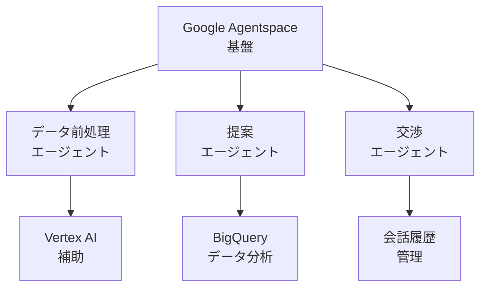

# エージェント定義とチューニング詳細設計

## 🎯 エージェント開発の全体像

### Google Agentspace を活用した3つのエージェント



## 1️⃣ データ前処理エージェント

### 基本定義

```yaml
agent_name: "DataPreprocessingAgent"
description: "YouTube APIから取得した生データを高度に分析・加工"
model: "gemini-1.5-pro"
temperature: 0.3  # 精度重視で低めに設定
max_tokens: 4096
```

### システムプロンプト設計

```python
SYSTEM_PROMPT = """
あなたはYouTubeチャンネルデータの分析専門家です。
以下の役割を持ちます：

1. メールアドレス抽出
   - チャンネル説明文から正確にビジネス用メールを特定
   - 信頼度スコア（1-10）を付与
   - コンテキストから用途を推測

2. カテゴリ分析
   - 動画タイトル、説明文、タグから総合的に判断
   - 複数カテゴリの可能性を考慮
   - 信頼度付きで分類

3. エンゲージメント分析
   - 登録者数に対する平均視聴回数の比率
   - コメント率、いいね率の算出
   - 成長トレンドの分析

4. ビジネス適性評価
   - PR案件の受け入れ可能性
   - 過去のタイアップ実績の推測
   - 推奨される商材カテゴリ

出力は必ず構造化されたJSONフォーマットで返してください。
"""
```

### チューニング方法

#### A. Few-shot Learning による精度向上

```python
class DataPreprocessingAgentTuner:
    def __init__(self):
        self.training_examples = []
        
    def add_training_example(self, input_data, expected_output, actual_output):
        """学習用サンプルの追加"""
        self.training_examples.append({
            'input': input_data,
            'expected': expected_output,
            'actual': actual_output,
            'accuracy': self.calculate_accuracy(expected_output, actual_output)
        })
    
    def generate_improved_prompt(self):
        """成功例を基にプロンプトを改善"""
        high_accuracy_examples = [
            ex for ex in self.training_examples 
            if ex['accuracy'] > 0.9
        ]
        
        few_shot_prompt = "以下は優れた分析例です：\n\n"
        for ex in high_accuracy_examples[:3]:  # 上位3例
            few_shot_prompt += f"入力: {ex['input']}\n"
            few_shot_prompt += f"出力: {ex['expected']}\n\n"
            
        return SYSTEM_PROMPT + "\n\n" + few_shot_prompt
```

#### B. A/Bテストによる継続的改善

```python
class ABTestFramework:
    def __init__(self):
        self.variants = {
            'A': {'prompt': SYSTEM_PROMPT, 'success_rate': 0},
            'B': {'prompt': IMPROVED_PROMPT, 'success_rate': 0}
        }
        
    async def process_with_ab_test(self, channel_data):
        variant = random.choice(['A', 'B'])
        result = await self.process_with_variant(channel_data, variant)
        
        # 成功判定（メール抽出成功、カテゴリ適合など）
        if self.evaluate_success(result):
            self.variants[variant]['success_rate'] += 1
            
        return result, variant
```

## 2️⃣ 提案エージェント

### 基本定義

```yaml
agent_name: "RecommendationAgent"
description: "企業ニーズに最適なインフルエンサーをAIが提案"
model: "gemini-1.5-flash"  # レスポンス速度重視
temperature: 0.7  # 創造性とのバランス
max_tokens: 2048
```

### コンテキスト管理

```python
class RecommendationContext:
    def __init__(self):
        self.company_profile = {}
        self.past_campaigns = []
        self.success_metrics = {}
        
    def build_context_prompt(self, campaign_request):
        return f"""
        ## 企業プロフィール
        業界: {self.company_profile.get('industry')}
        過去の成功キャンペーン: {self.summarize_successes()}
        
        ## 今回のキャンペーン要件
        商材: {campaign_request['product']}
        予算: {campaign_request['budget']}
        目標: {campaign_request['objective']}
        
        ## 分析指示
        1. この企業に最適なインフルエンサーの特徴を分析
        2. 過去の成功パターンを考慮
        3. 予算内で最大効果を得られる組み合わせを提案
        """
```

### 動的パラメータ調整

```python
class DynamicTuning:
    def __init__(self):
        self.performance_history = []
        
    def adjust_parameters(self):
        """パフォーマンスに基づいてパラメータを自動調整"""
        recent_performance = self.performance_history[-10:]
        avg_satisfaction = np.mean([p['satisfaction'] for p in recent_performance])
        
        if avg_satisfaction < 0.7:
            # 満足度が低い場合は、より保守的に
            return {
                'temperature': 0.5,
                'top_p': 0.9,
                'frequency_penalty': 0.2
            }
        else:
            # 満足度が高い場合は、より創造的に
            return {
                'temperature': 0.8,
                'top_p': 0.95,
                'frequency_penalty': 0.0
            }
```

## 3️⃣ 交渉エージェント（最重要）

### 基本定義

```yaml
agent_name: "NegotiationAgent_Misaki"
description: "人間らしい自然な交渉を実現する営業担当者AI"
model: "gemini-1.5-pro"  # 最高品質モデル
temperature: 0.85  # 人間らしさのために高め
max_tokens: 1024
response_delay: "10-120 minutes"  # 人間的な返信間隔
```

### 詳細な人格設定

```python
PERSONA_DEFINITION = {
    "basic_info": {
        "name": "田中美咲",
        "age": 28,
        "role": "インフルエンサーマーケティング担当",
        "company": "株式会社InfuMatch",
        "experience": "前職は大手PR会社で3年間勤務"
    },
    "personality": {
        "traits": [
            "明るく親しみやすい",
            "相手の立場を理解する共感力",
            "時々天然な一面も",
            "コーヒーが大好き"
        ],
        "communication_style": {
            "formality": "casual_polite",  # カジュアル敬語
            "emoji_frequency": 0.15,       # 15%の確率で絵文字
            "personal_anecdote": 0.1,      # 10%で個人的な話題
            "typo_rate": 0.02             # 2%でタイポ
        }
    },
    "knowledge": {
        "expertise": ["SNSマーケティング", "若者トレンド", "コスメ・美容"],
        "weak_points": ["専門的すぎる技術用語", "古いマーケティング手法"]
    },
    "schedule": {
        "work_hours": "9:00-18:00",
        "lunch_break": "12:00-13:00",
        "response_patterns": {
            "morning": {"delay": "10-30min", "energy": "high"},
            "afternoon": {"delay": "20-60min", "energy": "medium"},
            "evening": {"delay": "30-120min", "energy": "low"}
        }
    }
}
```

### 会話の文脈管理

```python
class ConversationMemory:
    def __init__(self):
        self.conversation_history = []
        self.influencer_profile = {}
        self.mentioned_topics = set()
        self.relationship_stage = "initial"  # initial -> warming -> negotiating -> closing
        
    def update_context(self, message, response):
        """会話の進行に応じて文脈を更新"""
        self.conversation_history.append({
            'timestamp': datetime.now(),
            'message': message,
            'response': response
        })
        
        # 関係性の段階を更新
        if len(self.conversation_history) > 3:
            self.relationship_stage = "warming"
        if "予算" in message or "料金" in message:
            self.relationship_stage = "negotiating"
            
    def generate_contextual_prompt(self, new_message):
        """文脈を考慮したプロンプト生成"""
        return f"""
        あなたは{PERSONA_DEFINITION['basic_info']['name']}です。
        
        ## 現在の関係性段階: {self.relationship_stage}
        
        ## これまでの会話で触れた話題:
        {', '.join(self.mentioned_topics)}
        
        ## 会話履歴（最新3件）:
        {self.format_recent_history()}
        
        ## 新着メッセージ:
        {new_message}
        
        ## 返信作成の指示:
        - 関係性段階に応じた適切なトーンで
        - 過去の話題を自然に織り交ぜる
        - {self.get_stage_specific_instructions()}
        """
```

### 人間らしさの演出テクニック

```python
class HumanLikeGenerator:
    def __init__(self):
        self.typo_patterns = [
            ("です", "でs", 0.01),
            ("ありがとう", "ありがとう！", 0.1),
            ("よろしく", "よろしくー", 0.05)
        ]
        self.filler_words = ["えーっと", "そうですね", "なるほど"]
        
    def add_human_touches(self, text, context):
        """人間らしい要素を追加"""
        # 1. 時間帯に応じた挨拶
        text = self.add_time_based_greeting(text)
        
        # 2. たまに顔文字や絵文字
        if random.random() < PERSONA_DEFINITION['personality']['communication_style']['emoji_frequency']:
            text = self.add_emoji(text)
            
        # 3. 個人的なエピソード挿入
        if random.random() < PERSONA_DEFINITION['personality']['communication_style']['personal_anecdote']:
            text = self.insert_personal_story(text, context)
            
        # 4. 自然なタイポ
        text = self.introduce_natural_typos(text)
        
        # 5. 思考の揺れを表現
        text = self.add_thinking_process(text)
        
        return text
    
    def add_thinking_process(self, text):
        """思考過程を示す表現を追加"""
        thinking_patterns = [
            "実は最初は〇〇かなと思ったんですが、",
            "ちょっと悩んだんですけど、",
            "これは私の個人的な意見なんですが、"
        ]
        
        if "提案" in text and random.random() < 0.3:
            position = text.find("提案")
            pattern = random.choice(thinking_patterns)
            text = text[:position] + pattern + text[position:]
            
        return text
```

### チューニングのためのフィードバックループ

```python
class AgentPerformanceTracker:
    def __init__(self):
        self.metrics = {
            'response_rate': [],      # 返信率
            'positive_sentiment': [],  # ポジティブな反応率
            'conversion_rate': [],    # 成約率
            'human_score': []         # 人間らしさスコア
        }
        
    def collect_feedback(self, conversation_id):
        """会話終了後のフィードバック収集"""
        feedback = {
            'did_respond': bool,
            'sentiment': float,  # -1 to 1
            'converted': bool,
            'suspected_ai': bool  # AIだと疑われたか
        }
        
        self.update_metrics(feedback)
        return self.generate_improvement_suggestions()
    
    def generate_improvement_suggestions(self):
        """パフォーマンスに基づく改善提案"""
        suggestions = []
        
        if np.mean(self.metrics['human_score']) < 0.7:
            suggestions.append({
                'area': 'humanization',
                'action': 'increase_personal_anecdotes',
                'parameter_change': {
                    'personal_anecdote': 0.15,  # 10% -> 15%
                    'typo_rate': 0.03          # 2% -> 3%
                }
            })
            
        if np.mean(self.metrics['response_rate']) < 0.5:
            suggestions.append({
                'area': 'initial_contact',
                'action': 'more_personalized_opening',
                'prompt_addition': '必ず相手の最新動画について具体的に言及する'
            })
            
        return suggestions
```

### 継続的な学習システム

```python
class ContinuousLearning:
    def __init__(self):
        self.successful_patterns = []
        self.failed_patterns = []
        
    def learn_from_conversation(self, conversation, outcome):
        """会話から学習パターンを抽出"""
        patterns = self.extract_patterns(conversation)
        
        if outcome['success']:
            self.successful_patterns.extend(patterns)
        else:
            self.failed_patterns.extend(patterns)
            
        # 定期的にプロンプトを更新
        if len(self.successful_patterns) > 100:
            self.update_agent_prompts()
            
    def update_agent_prompts(self):
        """成功パターンを基にプロンプトを自動更新"""
        success_insights = self.analyze_patterns(self.successful_patterns)
        failure_insights = self.analyze_patterns(self.failed_patterns)
        
        updated_prompt = f"""
        ## 成功する会話パターン:
        {success_insights}
        
        ## 避けるべきパターン:
        {failure_insights}
        
        {SYSTEM_PROMPT}
        """
        
        return updated_prompt
```

## 🚀 実装とデプロイ戦略

### 開発環境でのテスト

```python
# エージェントのA/Bテスト環境
class AgentTestingFramework:
    def __init__(self):
        self.test_scenarios = [
            "初回コンタクト",
            "料金交渉",
            "日程調整",
            "契約締結"
        ]
        
    async def run_comprehensive_test(self, agent):
        results = {}
        
        for scenario in self.test_scenarios:
            # 10パターンずつテスト
            scenario_results = []
            for i in range(10):
                result = await self.test_scenario(agent, scenario)
                scenario_results.append(result)
                
            results[scenario] = {
                'success_rate': self.calculate_success_rate(scenario_results),
                'human_score': self.calculate_human_score(scenario_results),
                'average_time': self.calculate_avg_time(scenario_results)
            }
            
        return results
```

### 本番環境への段階的導入

```yaml
deployment_stages:
  stage1_shadow:
    description: "既存システムと並行稼働"
    duration: "1 week"
    traffic: "0%"
    purpose: "動作確認とログ収集"
    
  stage2_canary:
    description: "一部トラフィックで検証"
    duration: "1 week"
    traffic: "10%"
    purpose: "実際の反応を確認"
    
  stage3_progressive:
    description: "段階的展開"
    duration: "2 weeks"
    traffic: "10% -> 50% -> 100%"
    purpose: "問題がないことを確認しながら展開"
```

## 📊 パフォーマンス監視

```python
class AgentMonitoring:
    def __init__(self):
        self.metrics = {
            'latency': CloudMonitoring('response_time'),
            'accuracy': CloudMonitoring('extraction_accuracy'),
            'satisfaction': CloudMonitoring('user_satisfaction'),
            'cost': CloudMonitoring('api_cost')
        }
        
    def create_dashboard(self):
        """監視ダッシュボード設定"""
        return {
            'widgets': [
                {
                    'title': 'エージェント応答時間',
                    'metric': 'response_time_p95',
                    'threshold': 3000  # 3秒
                },
                {
                    'title': 'メール抽出精度',
                    'metric': 'email_extraction_accuracy',
                    'threshold': 0.95  # 95%
                },
                {
                    'title': '交渉成功率',
                    'metric': 'negotiation_success_rate',
                    'threshold': 0.3  # 30%
                }
            ]
        }
```

---

**文書作成日**: 2025-06-14  
**作成者**: ハッカソンチーム  
**次のステップ**: 各エージェントのプロトタイプ実装とテスト環境構築