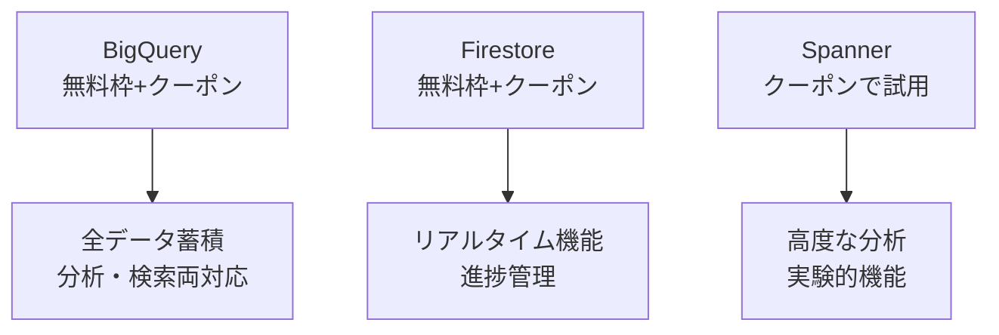
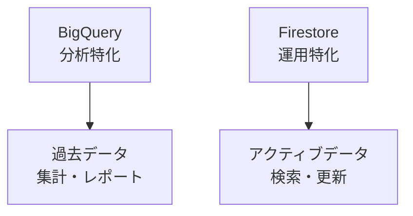
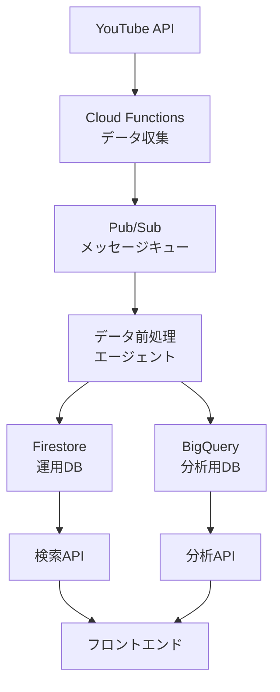
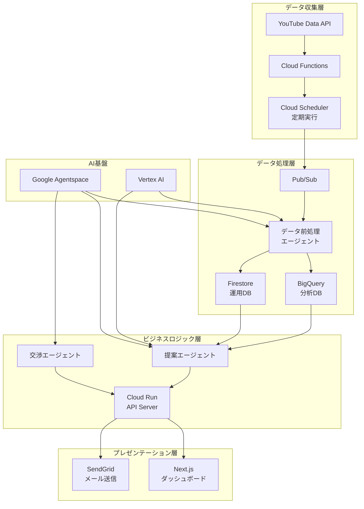

# YouTube Influencer Matching システムアーキテクチャ設計書

## 📋 機能要件整理

### 1. 裏での準備（データ収集・蓄積）
- チャンネルデータの継続的収集
- データ前処理エージェントによる分析・加工
- 大規模データの効率的な蓄積

### 2. UI部分・ユーザー体験
- 商材・カテゴリベースの検索機能
- 提案エージェントによるレコメンデーション
- 直感的なダッシュボード

### 3. 交渉プロセス
- メール自動送信による交渉開始
- 交渉エージェントによる自動進行
- 進捗の一元管理

## 🗄️ データストレージ比較分析（Google Cloud $300クーポン活用前提）

### 💡 Google Cloudクーポン活用戦略

**ハッカソン提供クーポン**: $300（約45,000円）
**期間**: 90日間有効
**戦略**: 初期開発・デモ期間中は積極的に高機能サービスを活用

### データベース選択肢の詳細比較

| 項目 | BigQuery | Firestore | Cloud SQL | Spanner | AlloyDB |
|------|----------|-----------|-----------|----------|----------|
| **コスト** | $5/TB storage<br>$5/TB query | $0.18/GB storage<br>読み書き課金 | $0.17/GB storage<br>固定インスタンス費 | $0.30/GB storage<br>高額インスタンス費 | $0.32/GB storage<br>PostgreSQL互換 |
| **無料枠** | 10GB storage<br>1TB query/月 | 1GB storage<br>50K read/day | なし | なし | なし |
| **スケーラビリティ** | ペタバイト級 | 自動スケール | 垂直スケール | 水平スケール | 高速スケール |
| **分析機能** | SQL分析最強 | 限定的 | 基本SQL | 高度SQL | PostgreSQL完全互換 |
| **リアルタイム性** | バッチ向き | リアルタイム | リアルタイム | リアルタイム | 超低レイテンシ |
| **ハッカソン適性** | ◎ | ◎ | ○ | △ | ○ |
| **クーポン効率** | 最高 | 高 | 中 | 低 | 中 |

### 🏆 クーポン活用を考慮した推奨アーキテクチャ

#### 開発・デモ期間（クーポン利用期間）


#### 本番移行後（クーポン終了後）


### 💰 クーポン活用の具体的プラン

#### Phase 1: 開発期間（0-30日）
```javascript
// BigQuery活用例
const devConfig = {
  bigquery: {
    dataset: 'youtube_influencers_dev',
    tables: [
      'channels_raw',        // 生データ全保存
      'channels_processed',  // 加工済みデータ
      'email_extractions',   // メール抽出結果
      'engagement_analytics' // エンゲージメント分析
    ],
    estimatedCost: '$50',  // クーポンから消費
  },
  firestore: {
    collections: [
      'active_campaigns',
      'negotiation_status',
      'user_preferences'
    ],
    estimatedCost: '$30',  // クーポンから消費
  }
};
```

#### Phase 2: デモ準備期間（31-60日）
- Spannerで高度な分析機能を実験（クーポン$100消費）
- Vertex AI/Agentspaceの大量テスト（クーポン$100消費）

#### Phase 3: ハッカソン本番（61-90日）
- 残りクーポンでデモ環境維持
- 本番相当の負荷テスト実施



**理由**:
- **BigQuery**: 大規模分析・集計に最適（過去データ、傾向分析）
- **Firestore**: リアルタイム検索・更新に最適（進捗管理、最新状態）

## 🤖 3つのエージェント詳細設計

### 1. データ前処理エージェント

```python
class DataPreprocessingAgent:
    """
    YouTube APIから取得した生データを加工・分析
    """
    
    def __init__(self):
        self.email_extractor = EmailExtractor()
        self.category_analyzer = CategoryAnalyzer()
        self.trend_analyzer = TrendAnalyzer()
        self.vertex_ai = VertexAI()
    
    async def process_channel(self, channel_data):
        # 1. メールアドレス抽出
        emails = await self.extract_emails(channel_data['description'])
        
        # 2. カテゴリ分析（AI活用）
        categories = await self.analyze_categories(channel_data)
        
        # 3. トレンド分析
        trends = await self.analyze_trends(channel_data)
        
        # 4. 示唆出し
        insights = await self.generate_insights(channel_data, categories, trends)
        
        return {
            'channel_id': channel_data['id'],
            'basic_info': self.extract_basic_info(channel_data),
            'emails': emails,
            'categories': categories,
            'trends': trends,
            'insights': insights,
            'engagement_score': self.calculate_engagement_score(channel_data),
            'processed_at': datetime.now()
        }
    
    async def extract_emails(self, description):
        """
        Vertex AI を使った高精度メール抽出
        """
        prompt = f"""
        以下のYouTubeチャンネル説明文から、ビジネス用メールアドレスを抽出してください。
        
        説明文:
        {description}
        
        抽出ルール:
        1. メールアドレスとその用途を特定
        2. 信頼度スコア(1-10)を付与
        3. ビジネス利用可能性を判定
        
        出力形式: JSON
        """
        
        response = await self.vertex_ai.generate(prompt)
        return json.loads(response)
```

### 2. 提案エージェント

```python
class RecommendationAgent:
    """
    企業のニーズに基づいて最適なインフルエンサーを提案
    """
    
    def __init__(self):
        self.agentspace = GoogleAgentspace()
        self.bigquery = BigQueryClient()
        
    async def recommend_influencers(self, campaign_data):
        # 1. 企業ニーズ分析
        needs_analysis = await self.analyze_campaign_needs(campaign_data)
        
        # 2. マッチングスコア計算
        candidates = await self.find_candidates(needs_analysis)
        
        # 3. AI による最適化
        recommendations = await self.optimize_recommendations(
            candidates, 
            campaign_data
        )
        
        return recommendations
    
    async def analyze_campaign_needs(self, campaign_data):
        """
        Google Agentspace を使った高度なニーズ分析
        """
        prompt = f"""
        以下のキャンペーン情報から、最適なインフルエンサーの条件を分析してください:
        
        商材: {campaign_data['product']}
        予算: {campaign_data['budget']}
        ターゲット: {campaign_data['target_audience']}
        目的: {campaign_data['objective']}
        
        分析項目:
        1. 推奨カテゴリ
        2. 理想的な登録者数レンジ
        3. エンゲージメント率の基準
        4. コンテンツスタイル
        """
        
        return await self.agentspace.analyze(prompt)
```

### 3. 交渉エージェント（最重要）

```python
class NegotiationAgent:
    """
    人間らしい自然な交渉を実現するAIエージェント
    """
    
    def __init__(self):
        self.agentspace = GoogleAgentspace()
        self.personality = self.load_personality_profile()
        
    def load_personality_profile(self):
        """
        AIだとバレないための人格設定
        """
        return {
            'name': '田中美咲',
            'role': 'インフルエンサーマーケティング担当',
            'company': '株式会社InfuMatch',
            'personality_traits': [
                '丁寧だが親しみやすい',
                '具体的な提案が得意',
                '相手の立場を理解する',
                'レスポンスは人間的なタイミング'
            ],
            'communication_style': {
                'greeting': 'casual_polite',  # カジュアル丁寧語
                'response_time': 'variable',   # 返信時間をランダム化
                'typo_rate': 0.01,            # 1%の確率でタイポ
                'emoji_usage': 'moderate'      # 適度な絵文字使用
            }
        }
    
    async def generate_initial_contact(self, influencer_data, campaign_data):
        """
        初回コンタクトメール生成
        """
        # 人間らしさを演出する要素
        current_time = datetime.now()
        time_based_greeting = self.get_time_based_greeting(current_time)
        
        # パーソナライズ要素の抽出
        recent_content = await self.analyze_recent_content(influencer_data)
        
        prompt = f"""
        あなたは{self.personality['name']}という
        インフルエンサーマーケティング担当者です。
        
        以下の条件で、自然な初回コンタクトメールを作成してください:
        
        ## インフルエンサー情報
        - チャンネル名: {influencer_data['channel_name']}
        - 最近の投稿: {recent_content}
        - カテゴリ: {influencer_data['categories']}
        
        ## キャンペーン情報
        - 商品: {campaign_data['product']}
        - 予算感: {campaign_data['budget_range']}
        
        ## 重要な指示
        1. {time_based_greeting}から始める
        2. 最近の投稿について具体的に言及する
        3. 提案は控えめに、まず興味を確認
        4. 署名は手打ち感を出す
        5. 絶対にAIだと悟られない自然な文章
        
        ## NG事項
        - 完璧すぎる文章
        - ビジネステンプレート感
        - AI特有の硬い表現
        """
        
        email = await self.agentspace.generate(prompt)
        
        # 人間らしさの後処理
        email = self.add_human_touches(email)
        
        return email
    
    def add_human_touches(self, email):
        """
        人間らしさを追加する後処理
        """
        import random
        
        # 1. たまにタイポを入れる（1%の確率）
        if random.random() < self.personality['communication_style']['typo_rate']:
            email = self.introduce_natural_typo(email)
        
        # 2. 改行位置を自然に
        email = self.naturalize_line_breaks(email)
        
        # 3. 署名を手打ち風に
        email = self.naturalize_signature(email)
        
        return email
    
    async def handle_negotiation_round(self, conversation_history, new_message):
        """
        交渉の各ラウンドを処理
        """
        # レスポンス時間をランダム化（10分〜2時間）
        await self.simulate_human_response_time()
        
        prompt = f"""
        あなたは{self.personality['name']}です。
        これまでの会話履歴を踏まえて、自然な返信を作成してください。
        
        会話履歴:
        {conversation_history}
        
        新着メッセージ:
        {new_message}
        
        指示:
        1. 会話の流れを自然に続ける
        2. 具体的な条件交渉を進める
        3. 相手の懸念に共感を示す
        4. 押し付けがましくない
        5. 時々個人的なエピソードを混ぜる
        """
        
        response = await self.agentspace.generate(prompt)
        return self.add_human_touches(response)
```

## 🏗️ システム全体アーキテクチャ



## 💡 AIがバレない工夫の詳細

### 1. タイミングの人間化
```python
def simulate_human_response_time():
    """人間的な返信タイミングをシミュレート"""
    base_time = random.randint(600, 7200)  # 10分〜2時間
    
    # 営業時間外は返信しない
    current_hour = datetime.now().hour
    if current_hour < 9 or current_hour > 18:
        # 翌営業日の朝に返信
        return calculate_next_business_hour()
    
    # 昼休みも考慮
    if 12 <= current_hour <= 13:
        base_time += random.randint(1800, 3600)
    
    return base_time
```

### 2. 文体のバリエーション
```python
email_templates = {
    'greeting': [
        'お世話になっております',
        'こんにちは',
        'はじめまして',
        'ご連絡させていただきました'
    ],
    'interest_check': [
        'もしご興味があれば',
        'もしよろしければ',
        'お時間あるときに',
        'ご検討いただければ'
    ],
    'closing': [
        'よろしくお願いいたします',
        'ご検討のほどよろしくお願いします',
        'お返事お待ちしています',
        'ご連絡お待ちしております'
    ]
}
```

### 3. パーソナライゼーション
- 最新動画への具体的な言及
- 投稿時間帯の把握と言及
- チャンネルの成長を褒める
- 共通の話題を見つける

## 🚀 実装優先順位（ハッカソン向け）

### Phase 1: MVP（Week 1-2）
1. [ ] YouTube API連携とデータ収集
2. [ ] BigQuery + Firestore セットアップ
3. [ ] データ前処理エージェント実装

### Phase 2: コア機能（Week 3-4）
1. [ ] 提案エージェント実装
2. [ ] 基本的な検索・フィルタリング
3. [ ] ダッシュボード基本機能

### Phase 3: 差別化機能（Week 5-6）
1. [ ] 交渉エージェント実装
2. [ ] 人間らしさの演出機能
3. [ ] デモ用シナリオ準備

## 💰 コスト試算

### 月間運用コスト（1000社利用想定）
- **BigQuery**: 1TB storage + 10TB query = $55
- **Firestore**: 50GB storage + 1M read/write = $100
- **Cloud Run**: 1M requests = $40
- **Vertex AI/Agentspace**: 10M tokens = $200
- **SendGrid**: 100K emails = $100
- **合計**: 約$500/月（6万円）

### 収益性
- 月額19,800円 × 1000社 = 1,980万円
- 粗利率: 97%

---

**文書作成日**: 2025-06-14  
**作成者**: ハッカソンチーム  
**ステータス**: 実装準備完了