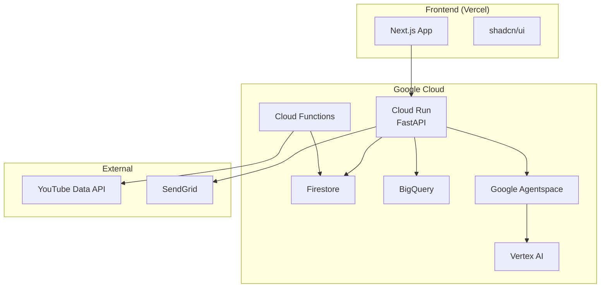

# ✅ ハッカソン要件チェックリスト

## 📋 必須条件の確認

### 1. Google Cloud アプリケーション関連サービス ✅

提案した技術スタックで使用するサービス:

- **Cloud Run** ✅ → FastAPI バックエンドで使用
- **Cloud Functions** ✅ → YouTube定期クロール、メール送信で使用

**要件達成状況**: 2つのサービスを使用（要件は1つ以上）

### 2. Google Cloud AI 技術 ✅

提案した技術スタックで使用するサービス:

- **Google Agentspace** ✅ → 3つのAIエージェントで使用
  - データ前処理エージェント
  - 提案エージェント
  - 交渉エージェント
- **Vertex AI** ✅ → AIモデル実行基盤として使用
- **Gemini API in Vertex AI** ✅ → Gemini Proモデルを使用

**要件達成状況**: 3つのAIサービスを使用（要件は1つ以上）

## 🏆 任意条件（特別賞対象）

### Firebase 賞対象 ⭐

- **Firestore** を使用 → Firebase賞の対象
- リアルタイムデータベースとして活用
- 認証機能も追加可能（Firebase Auth）

### Deep Dive 賞対象 ⭐

その他のGoogle Cloudサービスを積極活用:

- **BigQuery** → 大規模データ分析
- **Cloud Scheduler** → 定期実行
- **Cloud Monitoring** → システム監視
- **Pub/Sub** → メッセージング（オプション）

## 📄 提出物の準備状況

### 1. GitHubリポジトリ 📝

```yaml
リポジトリ構成:
  - /frontend → Next.jsアプリケーション
  - /backend → FastAPI + Cloud Run
  - /functions → Cloud Functions
  - README.md → プロジェクト説明
  - LICENSE → ライセンス情報
  
注意事項:
  - 公開リポジトリにする
  - 提出後は8月5日まで状態を保持
  - タグを使用して提出時点を明確化
```

### 2. デプロイURL 🌐

```yaml
必要なURL:
  - フロントエンド: https://[project-name].vercel.app
  - バックエンドAPI: https://[api-name].run.app
  - デモ環境: 上記フロントエンドURL/demo

期間: 2025年6月30日～7月16日まで動作確認可能な状態を維持
```

### 3. Zenn記事（4000-6000文字） 📚

必須要素:

#### ⅰ. プロジェクト説明文の構成案

```markdown
## 対象ユーザーと課題

**対象ユーザー**: 
- 中小企業のマーケティング担当者
- インフルエンサーマーケティング未経験者

**課題**:
- YouTubeマイクロインフルエンサーへのアプローチ方法が分からない
- 適切な報酬設定が困難
- 交渉に時間とスキルが必要

**ソリューション**:
- AI自動マッチング: Google Agentspaceが最適なインフルエンサーを発見
- 自動交渉: 人間らしいAIエージェントが交渉を代行
- 一元管理: ダッシュボードで全案件を可視化

**特徴**:
- YouTube特化で高精度マッチング
- AIだとバレない自然な交渉
- 完全自動化で工数90%削減
```

#### ⅱ. システムアーキテクチャ図 🏗️



#### ⅲ. デモ動画（3分以内） 🎥

```yaml
デモシナリオ:
  0:00-0:30: 問題提起とソリューション紹介
  0:30-1:30: リアルタイムインフルエンサー発見デモ
  1:30-2:30: AI自動交渉の実演
  2:30-3:00: 成果と今後の展望

ポイント:
  - 実際に動作する画面を録画
  - AIの自然な交渉文面を強調
  - 処理速度の速さをアピール
```

## 🚨 提出前の最終チェック

### 技術要件 ✅
- [ ] Cloud Run または Cloud Functions を使用
- [ ] Google Agentspace または Vertex AI を使用
- [ ] システムが実際に動作する

### 提出物 📦
- [ ] GitHubリポジトリ（公開設定）
- [ ] デプロイ済みURL（動作確認済み）
- [ ] Zenn記事（4000-6000文字、必須3要素含む）

### 審査基準への対応 🎯
- [ ] **アイデアの質**: YouTubeインフルエンサー自動交渉という独創的アイデア
- [ ] **問題の明確さ**: 中小企業の明確なペインポイントを解決
- [ ] **実現性**: 実際に動作するプロトタイプ、拡張性のある設計

## 💡 追加の推奨事項

### パフォーマンス最適化
- Cloud CDN を追加してフロントエンド高速化
- Cloud Armor でセキュリティ強化

### ドキュメント充実
- API仕様書（OpenAPI）
- 環境構築手順書
- アーキテクチャ設計書

### デモ環境の工夫
- サンプルデータを豊富に用意
- ワンクリックでデモ開始
- 結果を分かりやすく可視化

---

**結論**: 提案した技術スタックは**すべてのハッカソン要件を満たしています** ✅

特に以下の点で優位性があります:
1. 必須要件を大幅に上回るGoogle Cloudサービス活用
2. Firebase賞、Deep Dive賞の両方を狙える構成
3. 実装の容易さと拡張性のバランス

**次のアクション**: 開発環境のセットアップとHello Worldの実装